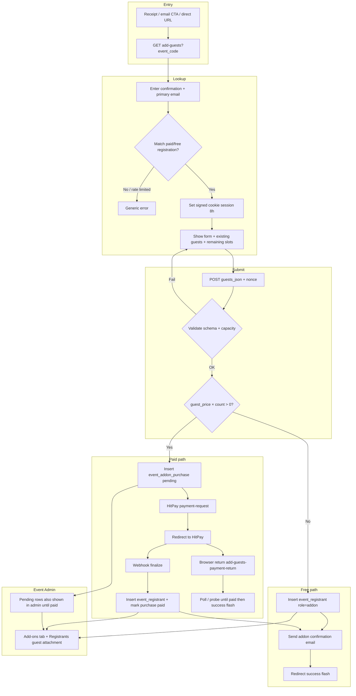

# Add Guests (`?action=add-guests`)

Post-registration guest add-on flow for **v2** events. A primary registrant looks up their paid registration by confirmation number + email, adds one or more guests on a dedicated form, and (when priced) pays via a **separate HitPay checkout**. Confirmed guests are appended to the **existing** `event_registration` — no second primary registration is created.

| | |
|---|---|
| **Public actions** | `add-guests`, `add-guests-payment-return` |
| **Entry URL** | `{page}?action=add-guests&event_code={code}` |
| **Auth** | Public lookup (confirmation + primary email) + signed cookie session |
| **Storage** | `event_addon_purchase` (paid batches) → `event_registrant` (`role = addon`) |
| **Parent header** | Unchanged (`total_amount` / `payment_status` stay as original purchase) |

Local (MAMP example):

```
http://localhost:8888/BSS/registration-manager/?action=add-guests&event_code=YOUR_CODE
```

---

## 1. Product rules

1. **Append-to-parent** — Guest lines attach to the existing registration via `registration_id`.
2. **Separate checkout** — Paid add-ons use `event_addon_purchase` + HitPay; they do not reopen the original registration payment.
3. **Order numbers** — Continuity with in-wizard guests: `{primary_order}-01`, `-02`, …
4. **Capacity** — Per-registration `guest_max` and event-wide `guest_event_max` both apply; pending unpaid purchases reserve slots.
5. **Eligibility** — v2 only; guests enabled; `allow_post_registration` not disabled; primary registration `payment_status` in `paid` / `free`.
6. **Free guests** (`guest_price = 0`) — Skip purchase table; insert confirmed rows immediately.

---

## 2. End-to-end process flow



### 2.1 Step-by-step (public)

| Step | Actor | What happens |
|------|--------|--------------|
| 1 | User | Opens `?action=add-guests&event_code=…` (optional `lang`) |
| 2 | System | Loads event; rejects if not v2 / guests off / post-reg disabled |
| 3 | User | Submits confirmation number + primary email (`rm_guest_manage_action=login`) |
| 4 | System | Rate-limits lookups; finds `event_registration`; sets `rm_guest_manage` cookie |
| 5 | User | Sees capacity, existing guests, dynamic guest fields; submits guests |
| 6a | System (free) | `rm_v2_insert_guest_lines()` → email → success redirect |
| 6b | System (paid) | Insert `event_addon_purchase` → HitPay → webhook finalize → email |
| 7 | User | Sees success on add-guests page (`?added={flash_key}`) |

### 2.2 Payment finalize (authoritative)

**Webhook** is authoritative. Browser return URL (`add-guests-payment-return`) is display-oriented: it probes HitPay / polls until the purchase is `paid` (or shows failure), then redirects to the success flash. Duplicate finalize is idempotent.

Reference number format:

```
{parent_confirmation}-addon-{purchase_id}
```

---

## 3. Routes and request params

Defined in `includes/request.php` / routed via `includes/controller.php` → `index.php`.

| URL | Purpose |
|-----|---------|
| `?action=add-guests&event_code={code}` | Lookup or form (session-dependent) |
| `?action=add-guests&event_code={code}&lang=zh_CN` | Same, Chinese UI |
| `?action=add-guests&event_code={code}&added={flash}` | Success after free submit or paid return |
| `?action=add-guests-payment-return&event_code={code}&purchase_id={id}` | HitPay redirect target |

**POST actions** (`rm_guest_manage_action`):

| Value | Purpose |
|-------|---------|
| `login` | Credential lookup → session cookie |
| `submit_guests` | Validate + save guests / start checkout |

Nonce: `rm_guest_manage_nonce` / action `rm_guest_manage`.

---

## 4. Data model

### 4.1 `event_addon_purchase`

Migration: [`migrations/006_event_addon_purchase.sql`](../migrations/006_event_addon_purchase.sql)  
Install hook: `rm_install_event_addon_purchase_schema()` in `includes/schema-install.php` (also triggered from `bootstrap.php`).

| Column | Role |
|--------|------|
| `registration_id` | Parent registration |
| `event_id` | Event |
| `confirmation_number` | Parent confirmation (lookup / payment ref) |
| `guest_count` | Guests in this batch |
| `subtotal` / `total_amount` | Batch pricing |
| `payment_status` | `pending` → `paid` / `failed` / `free` |
| `payment_request_id` | HitPay request id |
| `guest_payload` | Validated guest rows JSON (pre-insert) |
| `pricing_snapshot` | Live price snapshot at submit |
| `form_schema_snapshot` | Guest fields + labels at submit |
| `is_email_confirmation_sent` | Addon confirmation email flag |
| `paid_at` | When marked paid |

**Why a separate table:** Parent header amounts stay immutable; each add-on batch has its own HitPay audit trail; webhook can finalize without touching the original pending/finalize registration flow.

### 4.2 Confirmed guest lines (`event_registrant`)

Inserted by `rm_v2_insert_guest_lines()`:

| Field | Value |
|-------|--------|
| `role` | `addon` |
| `registration_id` | Parent id |
| `order_number` | `{primary}-NN` via `rm_format_guest_order_number()` |
| `member_index` | Continues after existing members/addons |
| `unit_price` | Guest unit price from pricing snapshot |
| `status` | `confirmed` |

True guest add-ons are distinguished from `group_per_head` package slots (also `role=addon`) by the `-{NN}` order-number suffix (`rm_guest_is_guest_addon_row` / `rm_registrant_is_guest_addon_row`).

---

## 5. Capacity & eligibility

Computed in `rm_guest_manage_capacity_meta()`:

```
existing = COUNT guest addon rows on registration (suffix order numbers, not cancelled)
pending  = SUM(guest_count) FROM event_addon_purchase WHERE registration_id AND payment_status=pending
reg_remaining   = guest_max - existing - pending   (if guest_max > 0)
event_remaining = guest_event_max - event_used     (includes pending purchases event-wide)
slots_remaining = min(reg_remaining, event_remaining)
can_add = slots_remaining > 0 (or unlimited when maxes are 0)
```

Event-wide used count: `rm_v2_count_event_addons()` — confirmed + pending registrant tables + pending `event_addon_purchase` guests.

Config gates:

- `settings.registration.guests.enabled`
- `settings.registration.guests.allow_post_registration` (default `true` when omitted)
- Toggle in Event Admin → Event Settings (`guests_allow_post_registration`)

---

## 6. Session & security

| Mechanism | Detail |
|-----------|--------|
| Cookie | `rm_guest_manage` — HMAC-signed payload (`registration_id` + expiry), 8h TTL, HttpOnly, SameSite=Lax |
| Lookup rate limit | 10 attempts / hour / IP (`RM_GUEST_LOOKUP_RATE_LIMIT`) |
| Errors | Generic “could not find registration” (no email/confirmation enumeration) |
| Nonce | Required on POST |
| Session re-check | Every form POST re-validates cookie → registration → event match |

---

## 7. Admin reflection (Event Profile)

After guests are confirmed (or while a purchase is still `pending`), Event Admin surfaces them without a separate admin UI for purchases:

| Surface | Behavior |
|---------|----------|
| **Add-ons / Guests tab** | Lists guest-addon rows; tab label total uses `rm_guest_event_capacity()` / `rm_v2_count_event_addons()` (includes pending purchases) |
| **Add-ons table body** | Pending purchase guests are merged via `rm_fetch_pending_addon_purchase_registrant_rows()` into the same presenter pipeline as confirmed addons |
| **Registrants table** | `rm_attach_guests_to_primary_registrants()` nests guests under the primary row (guest count button / modal) |
| **Export** | Confirmed `event_registrant` addon rows participate in existing `addon_filter` export paths |

Parent `event_registration.total_amount` is **not** increased by add-on batches. Finance for paid post-reg add-ons should sum `event_addon_purchase.total_amount WHERE payment_status='paid'`.

---

## 8. Email & receipt entry points

| Touchpoint | File / function |
|------------|-----------------|
| Addon confirmation email | `rm_email_send_addon_confirmation()` → `views/emails/addon-confirmation.php` |
| Payment confirmation CTA | `views/emails/payment-confirmation.php` — “Add guests later” when post-reg allowed |
| Registration receipt CTA | `views/partials/registration-receipt.php` |
| URL builders | `rm_add_guests_url()`, `rm_add_guests_page_url()`, `rm_add_guests_url_for_event()` |

---

## 9. Files affected

### 9.1 Core feature (new / primary)

| Path | Role |
|------|------|
| `includes/guest-manage-service.php` | Lookup, session, capacity, submit, finalize, context, pending-row normalizers |
| `views/add-guests.php` | Public page wrapper |
| `views/partials/add-guests-lookup.php` | Confirmation + email form |
| `views/partials/add-guests-form.php` | Guest-only form |
| `views/emails/addon-confirmation.php` | Post-add confirmation email |
| `migrations/006_event_addon_purchase.sql` | Purchase table DDL |

### 9.2 Routing & bootstrap

| Path | Role |
|------|------|
| `index.php` | Renders `add-guests` view |
| `bootstrap.php` | Loads guest-manage service; installs purchase schema if missing |
| `includes/controller.php` | Dispatches `add-guests` / `add-guests-payment-return` → `rm_build_add_guests_context()` |
| `includes/request.php` | Allows public actions; `rm_get_addon_purchase_id()` |
| `includes/schema-install.php` | `rm_install_event_addon_purchase_schema()`, `rm_event_addon_purchase_schema_ready()` |

### 9.3 Payment

| Path | Role |
|------|------|
| `includes/payment-service.php` | `rm_payment_initiate_addon_checkout()`, store request id, `rm_payment_try_finalize_addon_webhook()` |

### 9.4 Persistence / line items

| Path | Role |
|------|------|
| `includes/event-registration-service.php` | `rm_v2_insert_guest_lines()` (suffix offset), `rm_v2_count_event_addons()` (+ pending purchases) |
| `includes/registration-service.php` | `rm_format_guest_order_number()` |

### 9.5 Admin / presenters

| Path | Role |
|------|------|
| `includes/registrant-service.php` | Merge pending purchase rows in `rm_fetch_registrants_from_db()`; guest-addon filter; attach guests to primary; present add-on tab rows |
| `includes/event-profile-service.php` | Builds addons tab context / totals |
| `views/partials/event-profile-addons.php` | Add-ons tab UI |
| `views/event-profile.php` | Tab shell |
| `views/partials/event-profile-settings.php` | `allow_post_registration` toggle |
| `includes/registration-config-service.php` | Guests config defaults + normalize `allow_post_registration` |

### 9.6 Email / i18n / shared UI

| Path | Role |
|------|------|
| `includes/email-service.php` | Addon confirmation send + CTAs on payment confirmation context |
| `views/emails/payment-confirmation.php` | Add-guests-later block |
| `views/partials/registration-receipt.php` | Guest list + add-guests CTA |
| `lang/en.php`, `lang/zh_CN.php` | `guest_manage.*`, `email.add_guests_*` strings |
| `includes/i18n-service.php` | Public string keys for guest manage |

### 9.7 Supporting (reused, lightly touched or dependency)

| Path | Role |
|------|------|
| `includes/form-schema-service.php` | Guest schema / `rm_parse_guests_from_post()` |
| `includes/event-registrant-service.php` | `rm_normalize_v2_registrant_row()`, v2 fetch |
| `includes/pricing-service.php` | Guest price from registration config |
| `views/partials/register-wizard.php` | In-wizard guests (related; not post-reg path) |

---

## 10. Key functions map

| Function | File | Responsibility |
|----------|------|----------------|
| `rm_build_add_guests_context` | guest-manage-service | Full page context + POST handling |
| `rm_guest_manage_find_by_credentials` | guest-manage-service | Lookup registration |
| `rm_guest_manage_resolve_access` | guest-manage-service | Session / login gate |
| `rm_guest_manage_capacity_meta` | guest-manage-service | Slots remaining |
| `rm_guest_manage_submit` | guest-manage-service | Free insert or pending purchase |
| `rm_finalize_addon_purchase` | guest-manage-service | Idempotent paid finalize |
| `rm_payment_initiate_addon_checkout` | payment-service | HitPay request for purchase |
| `rm_payment_try_finalize_addon_webhook` | payment-service | Webhook → finalize |
| `rm_handle_addon_payment_return` | guest-manage-service | Browser return handling |
| `rm_v2_insert_guest_lines` | event-registration-service | Persist addon registrant rows |
| `rm_fetch_pending_addon_purchase_registrant_rows` | guest-manage-service | Admin pending display rows |
| `rm_email_send_addon_confirmation` | email-service | Confirmation email |
| `rm_guest_post_registration_allowed` | guest-manage-service | Feature gate |

---

## 11. Edge cases

| Case | Behavior |
|------|----------|
| Primary registered with 0 guests | Allowed; full remaining capacity shown |
| Per-reg or event max reached | Lookup may succeed; form blocks submit |
| Concurrent tabs | Transaction + re-count on finalize; pending purchases reserve capacity |
| Guest price changed after original reg | Uses **live** `guests.price`; snapshotted on purchase row |
| Legacy v1 registrants | Not supported |
| Unpaid primary | Lookup rejects |
| `group_per_head` `role=addon` package slots | Excluded from guest counts via order-number suffix rule |
| Webhook before browser return | Return page sees already `paid` → success flash |
| Free batch | No `event_addon_purchase` row |

---

## 12. Quick test checklist

1. Enable guests + post-registration on a v2 event; set a guest price and max.
2. Complete a primary registration (paid/free).
3. Open add-guests URL from receipt/email CTA; lookup with confirmation + primary email.
4. **Free path:** set price to `0`, submit → rows in `event_registrant`; email sent; admin Add-ons tab + primary guest attachment update.
5. **Paid path:** restore price, submit → row in `event_addon_purchase` (`pending`); HitPay checkout; after webhook → `paid` + registrant rows; pending disappears from “pending purchase” merge (confirmed rows remain).
6. Confirm tab label count includes pending then confirmed guests.
7. Confirm order numbers continue (`…-01`, `…-02`) after an initial in-wizard guest.
8. Disable `allow_post_registration` → page shows post-reg disabled error.

---

## 13. Related docs / plans

- Internal plan: [`.cursor/plans/add-on_only_form_de78e279.plan.md`](../../.cursor/plans/add-on_only_form_de78e279.plan.md)
- Export API (confirmed addon rows): [`REGISTRANTS-EXPORT-API.md`](./REGISTRANTS-EXPORT-API.md)
